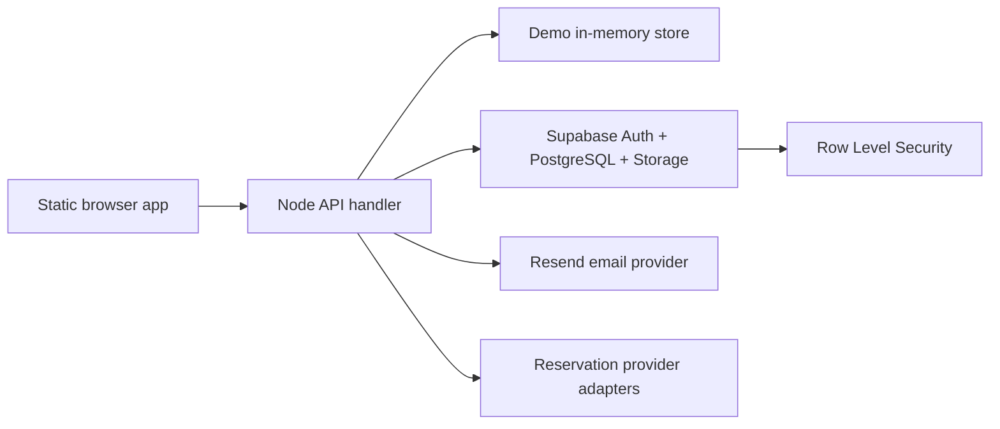
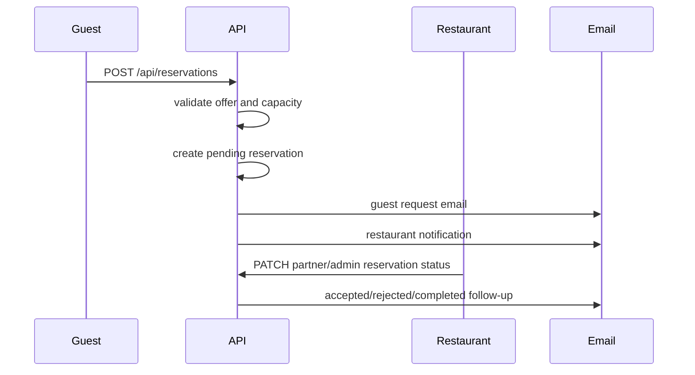

# SmartTable Documentation

Generated: 2026-07-18

This document was generated from the current SmartTable repository. It separates working, partial, demo, disabled, and planned features, and intentionally omits passwords, API keys, tokens, private data, and production credentials.

## Table of Contents

1. [Project Overview](#project-overview)
2. [Feature Status Summary](#feature-status-summary)
3. [Platform Modes](#platform-modes)
4. [User Functions](#user-functions)
5. [Architecture](#architecture)
6. [Folder Structure](#folder-structure)
7. [Frontend Route Structure and Redirects](#frontend-route-structure-and-redirects)
8. [SEO, Mobile, and Security Cleanup](#seo-mobile-and-security-cleanup)
9. [Reservation Integration Boundaries and POS Ban](#reservation-integration-boundaries-and-pos-ban)
10. [Subdomain Configuration](#subdomain-configuration)
11. [Database](#database)
12. [API Routes](#api-routes)
13. [Authentication and Permissions](#authentication-and-permissions)
14. [Reservation Flow](#reservation-flow)
15. [Feature Registry](#feature-registry)
16. [Language Support](#language-support)
17. [Environment Variables](#environment-variables)
18. [Local Setup](#local-setup)
19. [Deployment](#deployment)
20. [Testing](#testing)
21. [Known Issues](#known-issues)
22. [Future Roadmap](#future-roadmap)
23. [Scale Architecture Readiness](#scale-architecture-readiness)

## Project Overview

SmartTable is a discounted restaurant reservation marketplace with a static browser UI, a Node HTTP/API layer, Supabase-ready PostgreSQL migrations, demo-mode fallback data, Resend-ready transactional emails, partner/admin dashboards, and an AI Concierge mode that is gated by a platform mode and feature registry.

The current project can run locally without Supabase. In that case it uses in-memory/demo data and local `data/app-settings.json` for platform settings. With Supabase environment variables configured, API calls use Supabase Auth, PostgreSQL, Storage, and RLS-backed tables.

SmartTable integrates with reservation systems only. It does not connect to restaurant POS systems or access restaurant payment and transaction data.

Current persisted platform setting:

| Setting | Current value |
| --- | --- |
| `platform_mode` | `basic` |
| `ai_demo_visibility` | `False` |
| `show_ai_mode_badge` | `True` |

## Feature Status Summary

| Status | What it means in this codebase |
| --- | --- |
| Working | Frontend, API route, and data flow exist. In local mode it may use demo storage; in production it expects Supabase/Resend where appropriate. |
| Partial / Beta | Tables and UI/API are present, but the feature needs more production hardening, volume, or operational workflow. |
| Demo only | Deterministic mock/demo UI or local data exists. It must not be presented as live intelligence. |
| Disabled | Feature is intentionally unavailable or hidden by feature registry status. |
| Planned / Requires integration | Schema or placeholders exist, but live provider/API access is not connected. |

### Working

- Public restaurant/offer listing using `/api/public/offers`.
- Guest reservation request creation using `/api/reservations`.
- Admin management routes for restaurants, offers, reservations, content, notifications, reviews, and stats.
- Partner profile, offer, reservation, storage-signing, stats, and feedback routes.
- Platform Mode settings with Super Admin-only write access.
- English, Spanish, and Hungarian locale files.

### Partial / Beta

- Restaurant onboarding/profile editing and partner dashboard.
- Review moderation, post-visit feedback, photo reward submissions, and loyalty points.
- Integration Hub, CSV/manual reservation import, billing foundation, monitoring/error logs, privacy request structures.
- AI recommendation/action history and demand score structures.

### Demo only

- AI Advisor-style deterministic responses and mock analytics in `public/partner-ai-mock-data.js`.
- AI Concierge and Partner AI Demand UI when `platform_mode=ai_concierge` and `ai_demo_visibility=true`.

### Disabled

- Calendar sync is registered as disabled in the feature registry.

### Planned / Requires integration

- OpenTable, Resy, SevenRooms, Tock, Google Reserve, approved reservation APIs, weather, local events, Stripe billing, OpenAI service layer, vector database, and live image recognition.

## Platform Modes

SmartTable has two global modes in `src/app-core.js` and `data/app-settings.json`:

- `basic`: default mode. Shows the non-AI discounted restaurant reservation marketplace.
- `ai_concierge`: allows AI Concierge navigation and AI sections when the feature registry permits them.

AI demo visibility is separate from platform mode. Demo features only appear when:

1. platform mode is `ai_concierge`;
2. `ai_demo_visibility` is true;
3. the feature has status `demo`;
4. the audience and permissions match.

The Super Admin can change mode through `/api/admin/settings/platform-mode`. Regular admins can read the mode but cannot change it.

## User Functions

### Guest

- Browse restaurant cards and active offers.
- Filter/sort offer listings in the browser UI.
- Open restaurant details and reservation modal.
- Submit reservation request with contact info, party size, date/time, and notes.
- Follow/favorite restaurants by email.
- Submit reviews and post-visit/photo reward feedback.
- Use Hungarian, English, or Spanish UI.
- Access AI Concierge only in AI mode and only when the feature is visible.

### Restaurant Partner

- Log in and view only linked restaurant data.
- Edit restaurant profile fields and media URLs.
- Create, edit, pause/expire/delete offers.
- View reservations/leads.
- Accept, reject, cancel, complete, no-show reservations and add notes.
- View stats, post-visit feedback, integrations/imports, and AI Demand entry when enabled.

### Admin

- Manage restaurants, partners, offers, reservations, reviews, public content, notifications, feature flags, integrations, billing foundation, monitoring, privacy requests, and statistics.
- View current platform mode.
- Regular admin cannot switch global platform mode.

### Super Admin

- Has `super_admin` role support in the app profile model.
- Can switch BASIC and AI_CONCIERGE mode.
- Can enable AI Demo Visibility and public AI mode badge.
- Can impersonate/view as partner through `/api/admin/impersonate-partner`.
- Can see AI preview controls when AI admin controls are visible.

## Architecture



Runtime pieces:

- `server.js` serves static files from `public/` and forwards `/api/*` requests to `handleApiRequest`.
- `api/index.js` is the Vercel serverless entry point.
- `src/app-core.js` contains route handling, demo fallback data, Supabase access, email sending, feature registry, permissions, and business logic.
- `src/reservation-providers.js` contains generic and provider-specific mock adapters for future reservation integrations.
- `public/app.js` contains the single-page browser UI.

## Folder Structure

| Path | Purpose |
| --- | --- |
| `api/` | Vercel API entry files. |
| `data/app-settings.json` | Local demo persistence for Platform Mode settings. |
| `public/` | Static frontend, styles, images, locale files, manifest, robots, sitemap. |
| `scripts/` | Project checks and documentation generation. |
| `src/` | Backend core and reservation provider abstraction. |
| `supabase/migrations/` | PostgreSQL schema, views, RLS policies, seeds, and platform settings. |
| `backups/` | Manual/autosave snapshots. Not part of runtime source. |

Active source files documented:

- `server.js`
- `api/index.js`
- `api/[...path].js`
- `src/app-core.js`
- `src/reservation-providers.js`
- `public/app.js`
- `public/partner-ai-mock-data.js`
- `public/locales/en.json`
- `public/locales/es.json`
- `public/locales/hu.json`
- `supabase/migrations/*.sql`

## Frontend Route Structure and Redirects

The browser app is a single-page application with shared backend, shared auth, shared API, shared database, shared translations, and shared platform settings. It does not create a second guest backend or a second guest auth system.

### Guest public routes

- `/`
- `/restaurants`
- `/restaurants/:slug`
- `/offers`
- `/signup`
- `/login`
- `/forgot-password`
- `/reset-password`
- `/terms`
- `/privacy`
- `/contact`
- `/help`

### Protected guest routes

- `/account`
- `/account/reservations`
- `/account/favorites`
- `/account/profile`
- `/account/preferences`
- `/account/notifications`
- `/account/reviews`
- `/account/security`

### Partner routes

- `/partner`
- `/partner/offers`
- `/partner/reservations`
- `/partner/profile`
- `/partner/analytics`
- `/partner/settings`
- `/partner/ai-demand` when AI_CONCIERGE visibility allows it

### Admin routes

- `/admin`
- `/admin/restaurants`
- `/admin/offers`
- `/admin/users`
- `/admin/notifications`
- `/admin/content`
- `/admin/platform-settings`
- `/admin/ai-controls` when AI_CONCIERGE visibility allows it

### Compatibility and redirects

Direct URL refreshes are supported by the server's SPA fallback. Existing hash routes such as `#guest-signup`, `#partner-ai-demand`, and `#admin-ai-controls` remain compatibility aliases for visible navigation. Old guest URLs should either keep working through the SPA fallback or route to the closest current section; do not remove a public route without a redirect/alias.

## SEO, Mobile, and Security Cleanup

Public guest pages now have route-aware SEO metadata in the server and client:

- unique titles and meta descriptions for home, restaurants, offers, restaurant detail, signup, terms, privacy, and contact/help routes;
- canonical URL updates;
- Open Graph title, description, and URL updates;
- dynamic `robots.txt` and `sitemap.xml` support;
- static `public/robots.txt` and `public/sitemap.xml` fallback files;
- noindex handling for partner, admin, restaurant dashboard, private account, login/reset, and post-visit upload routes.

Responsive cleanup covers narrow phone widths, modal containment, signup option grids, account/dashboard cards, filter rows, and touch-friendly 44px controls. The public API response for offers removes private/internal fields such as restaurant email, owner IDs, partner notes, admin notes, roles, permissions, tokens, and secrets.

Security headers are applied by the local Node server:

- `x-content-type-options: nosniff`
- `x-frame-options: DENY`
- `referrer-policy: strict-origin-when-cross-origin`
- `permissions-policy: camera=(), microphone=(), payment=()`

## Reservation Integration Boundaries and POS Ban

SmartTable integrates with reservation systems only. It does not connect to restaurant POS systems or access restaurant payment and transaction data.

Supported future integration boundary:

- Resy
- OpenTable
- SevenRooms
- Tock
- Google Reserve
- approved restaurant reservation APIs
- CSV/manual reservation import when provider API access is unavailable

Explicitly not supported:

- Toast POS
- Square POS
- Clover
- Lightspeed
- Oracle MICROS
- TouchBistro
- restaurant payment, card, order, item-level sales, inventory, cash register, employee sales, tip, refund, or settlement data

AI and analytics may use SmartTable and approved reservation-platform data only: reservation count, available times, table availability, party size, accepted/declined/cancelled/no-show status when supplied, historical booking patterns, capacity supplied by partner, active offers, conversions, searches, clicks, favorites, ratings, feedback, events, weather, and traffic when separately integrated.

## Subdomain Configuration

The current app can be deployed as one shared application behind different domains or subdomains. The frontend surfaces stay separate in routing, but all surfaces use the same backend/API/database/auth.

Recommended deployment mapping:

| Host | Route target |
| --- | --- |
| `smarttable.com` | Guest marketplace `/` |
| `www.smarttable.com` | Guest marketplace `/` |
| `partners.smarttable.com` | `/partner` or a rewrite to `/partner` |
| `admin.smarttable.com` | `/admin` or a rewrite to `/admin` |

Set `PUBLIC_BASE_URL` to the primary public guest URL used in emails and canonical links. Keep partner/admin subdomain access protected by server-side auth and role checks.

## Database

The repository contains 34 Supabase migrations, 60 unique tables, 6 unique views, 80 indexes, and 81 unique policies.

### Tables

| Table | First migration | Purpose |
| --- | --- | --- |
| `admin_alerts` | 0024_integration_hub_billing_monitoring.sql | Admin alert records. |
| `admin_notifications` | 0008_reviews_notifications_newest.sql | Admin notification center. |
| `ai_action_results` | 0023_real_ai_operating_system_foundation.sql | Measured AI action results. |
| `ai_actions` | 0023_real_ai_operating_system_foundation.sql | AI recommendation approval/action records. |
| `ai_demand_forecasts` | 0009_ai_platform_foundation.sql | Demand forecast storage. |
| `ai_interaction_events` | 0009_ai_platform_foundation.sql | AI learning/interactions event log. |
| `ai_preference_profiles` | 0009_ai_platform_foundation.sql | Guest AI preference profiles. |
| `ai_processing_jobs` | 0010_restaurant_intelligence_expansion.sql | Future async AI job queue records. |
| `ai_recommendations` | 0023_real_ai_operating_system_foundation.sql | AI recommendation records. |
| `ai_route_plans` | 0010_restaurant_intelligence_expansion.sql | Route planning estimates. |
| `ai_service_time_observations` | 0010_restaurant_intelligence_expansion.sql | Service duration observations. |
| `analytics_events` | 0010_restaurant_intelligence_expansion.sql | Generic analytics events. |
| `app_error_logs` | 0024_integration_hub_billing_monitoring.sql | Application error and audit-like log storage. |
| `app_settings` | 0027_platform_mode_settings.sql | Persistent platform settings including Platform Mode. |
| `audit_logs` | 0010_restaurant_intelligence_expansion.sql | Audit/activity log. |
| `billing_plans` | 0024_integration_hub_billing_monitoring.sql | Billing plan foundation. |
| `calendar_connections` | 0009_ai_platform_foundation.sql | Future calendar connection records. |
| `data_import_jobs` | 0024_integration_hub_billing_monitoring.sql | CSV/manual import jobs. |
| `demand_snapshots` | 0023_real_ai_operating_system_foundation.sql | Demand score/history snapshots. |
| `dining_consumption_uploads` | 0010_restaurant_intelligence_expansion.sql | Dining photo/review intelligence submissions. |
| `email_events` | 0001_initial_schema.sql | Legacy/demo email event logging. |
| `email_logs` | 0023_real_ai_operating_system_foundation.sql | Transactional/campaign email logs. |
| `email_unsubscribes` | 0024_integration_hub_billing_monitoring.sql | Unsubscribe records. |
| `feature_flags` | 0024_integration_hub_billing_monitoring.sql | Admin-managed feature flags. |
| `feature_status` | 0023_real_ai_operating_system_foundation.sql | Feature status registry in database. |
| `guest_auth_events` | 0031_guest_account_auth_system.sql | Structured table defined by migrations. |
| `guest_consents` | 0024_integration_hub_billing_monitoring.sql | Consent records. |
| `guest_feedback` | 0023_real_ai_operating_system_foundation.sql | Post-visit guest feedback and moderation. |
| `guest_notifications` | 0019_post_visit_photo_rewards.sql | Structured table defined by migrations. |
| `guest_profiles` | 0023_real_ai_operating_system_foundation.sql | Extended guest preferences/profile data. |
| `guests` | 0023_real_ai_operating_system_foundation.sql | Guest identity records. |
| `imported_guests` | 0023_real_ai_operating_system_foundation.sql | Imported guest records. |
| `imported_reservations` | 0023_real_ai_operating_system_foundation.sql | Imported reservation history. |
| `integration_connections` | 0023_real_ai_operating_system_foundation.sql | Restaurant integration connections/status. |
| `integration_error_logs` | 0024_integration_hub_billing_monitoring.sql | Integration error logs. |
| `integration_sync_runs` | 0024_integration_hub_billing_monitoring.sql | Integration sync run logs. |
| `integrations` | 0023_real_ai_operating_system_foundation.sql | Integration provider catalog. |
| `invoices` | 0024_integration_hub_billing_monitoring.sql | Invoice foundation. |
| `legal_documents` | 0024_integration_hub_billing_monitoring.sql | Terms/privacy document records. |
| `loyalty_accounts` | 0010_restaurant_intelligence_expansion.sql | Guest loyalty point/badge records. |
| `manual_performance_uploads` | 0024_integration_hub_billing_monitoring.sql | Manual weekly performance uploads. |
| `marketing_campaigns` | 0023_real_ai_operating_system_foundation.sql | Campaign records generated manually or by AI approval. |
| `notification_logs` | 0023_real_ai_operating_system_foundation.sql | Guest notification logs. |
| `offers` | 0001_initial_schema.sql | Discounted table availability and offer rules. |
| `payment_events` | 0024_integration_hub_billing_monitoring.sql | Payment event foundation. |
| `privacy_requests` | 0024_integration_hub_billing_monitoring.sql | Data/privacy request records. |
| `profiles` | 0001_initial_schema.sql | User profiles and roles. |
| `push_delivery_logs` | 0034_scale_readiness_feature_flags_booking.sql | Structured table defined by migrations. |
| `push_subscriptions` | 0034_scale_readiness_feature_flags_booking.sql | Structured table defined by migrations. |
| `reservation_sources` | 0023_real_ai_operating_system_foundation.sql | External/manual reservation source catalog. |
| `reservations` | 0001_initial_schema.sql | SmartTable reservation leads and status tracking. |
| `restaurant_followers` | 0007_restaurant_order_followers_maps.sql | Email-based restaurant follow/favorite subscriptions. |
| `restaurant_integrations` | 0009_ai_platform_foundation.sql | Legacy restaurant integration settings. |
| `restaurant_reviews` | 0008_reviews_notifications_newest.sql | Food/service/ambience reviews and moderation status. |
| `restaurant_users` | 0023_real_ai_operating_system_foundation.sql | Restaurant team-member/account relationships. |
| `restaurant_view_events` | 0004_saas_platform_content_partner.sql | Restaurant view tracking. |
| `restaurants` | 0001_initial_schema.sql | Restaurant profile, location, billing, and operating data. |
| `revenue_snapshots` | 0023_real_ai_operating_system_foundation.sql | Revenue/value snapshots. |
| `site_content` | 0004_saas_platform_content_partner.sql | Admin-editable public content keys. |
| `subscriptions` | 0024_integration_hub_billing_monitoring.sql | Restaurant subscription foundation. |

### Views

- `admin_notifications_overview` - first defined in `0008_reviews_notifications_newest.sql`
- `public_available_offers` - first defined in `0001_initial_schema.sql`
- `public_restaurant_cards` - first defined in `0008_reviews_notifications_newest.sql`
- `reservation_overview` - first defined in `0001_initial_schema.sql`
- `restaurant_review_summary` - first defined in `0008_reviews_notifications_newest.sql`
- `restaurant_reviews_overview` - first defined in `0008_reviews_notifications_newest.sql`

### Enum types

- `offer_status` - first defined in `0001_initial_schema.sql`
- `profile_role` - first defined in `0001_initial_schema.sql`
- `reservation_status` - first defined in `0001_initial_schema.sql`
- `restaurant_status` - first defined in `0001_initial_schema.sql`

### Migration files

- `0001_initial_schema.sql`
- `0002_seed_demo_availability.sql`
- `0003_saas_enum_values.sql`
- `0004_saas_platform_content_partner.sql`
- `0005_billing_storage_email_templates.sql`
- `0006_super_admin_socials_offer_management.sql`
- `0007_restaurant_order_followers_maps.sql`
- `0008_reviews_notifications_newest.sql`
- `0009_ai_platform_foundation.sql`
- `0010_restaurant_intelligence_expansion.sql`
- `0011_partner_dashboard_demand_design.sql`
- `0012_advisor_profile_public_concierge.sql`
- `0013_ai_score_revenue_marketplace_insights.sql`
- `0014_benchmark_consumer_planner_expansion.sql`
- `0015_photo_rewards_recognition_loyalty_privacy.sql`
- `0016_partner_ai_revenue_operating_system.sql`
- `0017_partner_portfolio_ops_marketing_ai.sql`
- `0018_partner_ai_competitor_menu_reputation.sql`
- `0019_post_visit_photo_rewards.sql`
- `0020_partner_post_visit_feedback.sql`
- `0021_partner_ai_operating_system.sql`
- `0022_partner_dashboard_simplification.sql`
- `0023_real_ai_operating_system_foundation.sql`
- `0024_integration_hub_billing_monitoring.sql`
- `0025_ai_truth_status_updates.sql`
- `0026_hungarian_i18n.sql`
- `0027_platform_mode_settings.sql`
- `0028_remove_pos_integration_references.sql`
- `0029_guest_signup_onboarding_consents.sql`
- `0030_guest_signup_profile_preference_fields.sql`
- `0031_guest_account_auth_system.sql`
- `0032_guest_reservation_cancellation.sql`
- `0033_guest_privacy_security_controls.sql`
- `0034_scale_readiness_feature_flags_booking.sql`

## API Routes

The app exposes 64 distinct backend route paths through `/api/*`.

| Methods | Route | Audience | Status |
| --- | --- | --- | --- |
| `ANY` | `/admin/billing` | Admin / Super Admin | Beta / requires integration |
| `ANY` | `/admin/content` | Admin / Super Admin | Working / beta |
| `ANY` | `/admin/errors` | Admin / Super Admin | Working / beta |
| `ANY` | `/admin/feature-flags` | Admin / Super Admin | Working / beta |
| `ANY` | `/admin/impersonate-partner` | Admin / Super Admin | Working / beta |
| `ANY` | `/admin/integrations` | Admin / Super Admin | Beta / requires integration |
| `ANY` | `/admin/notifications` | Admin / Super Admin | Working / beta |
| `ANY` | `/admin/offers` | Admin / Super Admin | Working / beta |
| `ANY` | `/admin/partners` | Admin / Super Admin | Working / beta |
| `ANY` | `/admin/photo-reward-submissions` | Admin / Super Admin | Working / beta |
| `ANY` | `/admin/reservations` | Admin / Super Admin | Working / beta |
| `ANY` | `/admin/restaurants` | Admin / Super Admin | Working / beta |
| `ANY` | `/admin/reviews` | Admin / Super Admin | Working / beta |
| `ANY` | `/admin/settings/platform-mode` | Admin / Super Admin | Working / beta |
| `GET` | `/admin/stats` | Admin / Super Admin | Working / beta |
| `ANY` | `/ai/actions` | Guest / Partner / Admin, depending on endpoint | Beta / demo-aware |
| `ANY` | `/ai/consumption-uploads` | Guest / Partner / Admin, depending on endpoint | Beta / demo-aware |
| `ANY` | `/ai/consumption/sign-upload` | Guest / Partner / Admin, depending on endpoint | Beta / demo-aware |
| `ANY` | `/ai/demand-forecast` | Guest / Partner / Admin, depending on endpoint | Beta / demo-aware |
| `ANY` | `/ai/events` | Guest / Partner / Admin, depending on endpoint | Beta / demo-aware |
| `ANY` | `/ai/preferences` | Guest / Partner / Admin, depending on endpoint | Beta / demo-aware |
| `GET` | `/ai/recommendations` | Guest / Partner / Admin, depending on endpoint | Beta / demo-aware |
| `ANY` | `/ai/recommendations/restaurant` | Guest / Partner / Admin, depending on endpoint | Beta / demo-aware |
| `ANY` | `/ai/restaurant-intelligence` | Guest / Partner / Admin, depending on endpoint | Beta / demo-aware |
| `ANY` | `/ai/route-plan` | Guest / Partner / Admin, depending on endpoint | Beta / demo-aware |
| `ANY` | `/ai/service-time-estimate` | Guest / Partner / Admin, depending on endpoint | Beta / demo-aware |
| `ANY` | `/ai/trends` | Guest / Partner / Admin, depending on endpoint | Beta / demo-aware |
| `ANY` | `/analytics/events` | System / Public | Working |
| `ANY` | `/api/index` | System / Public | Working |
| `ANY` | `/auth/forgot-password` | Public / authenticated | Working |
| `ANY` | `/auth/language` | Public / authenticated | Working |
| `POST` | `/auth/login` | Public / authenticated | Working |
| `ANY` | `/auth/logout` | Public / authenticated | Working |
| `GET` | `/auth/me` | Public / authenticated | Working |
| `ANY` | `/auth/reset-password` | Public / authenticated | Working |
| `ANY` | `/auth/security` | Public / authenticated | Working |
| `POST` | `/auth/signup-guest` | Public / authenticated | Working |
| `ANY` | `/auth/verification` | Public / authenticated | Working |
| `ANY` | `/guest/account` | Guest | Working |
| `ANY` | `/guest/favorites` | Guest | Working |
| `ANY` | `/guest/notifications` | Guest | Working |
| `ANY` | `/guest/preferences` | Guest | Working |
| `ANY` | `/guest/privacy` | Guest | Working |
| `ANY` | `/guest/reservations` | Guest | Working |
| `GET` | `/health` | System / Public | Working |
| `ANY` | `/integrations/import-reservations` | Partner / Admin | Working |
| `ANY` | `/partner/integrations` | Partner / Admin | Working / beta |
| `ANY` | `/partner/offers` | Partner / Admin | Working / beta |
| `ANY` | `/partner/photo-reward-submissions` | Partner / Admin | Working / beta |
| `ANY` | `/partner/profile` | Partner / Admin | Working / beta |
| `ANY` | `/partner/reservations` | Partner / Admin | Working / beta |
| `GET` | `/partner/stats` | Partner / Admin | Working / beta |
| `ANY` | `/partner/storage/sign-upload` | Partner / Admin | Working / beta |
| `ANY` | `/privacy/requests` | Public / Admin | Working |
| `GET` | `/public/config` | Public | Working |
| `GET` | `/public/content` | Public | Working |
| `POST` | `/public/follow` | Public | Working |
| `GET` | `/public/offers` | Public | Working |
| `GET` | `/public/restaurants/newest` | Public | Working |
| `POST` | `/public/reviews` | Public | Working |
| `GET` | `/public/rewards/context` | Public | Working |
| `POST` | `/reservations` | System / Public | Working |
| `GET` | `/system/checklists` | System / Public | Working |
| `GET` | `/system/feature-status` | System / Public | Working |

## Authentication and Permissions

Authentication uses Supabase Auth when configured. In local/demo mode, the app uses seeded demo users in memory; this documentation intentionally omits demo passwords.

Implemented role concepts:

- `super_admin`: can switch platform mode and impersonate partners.
- `admin`: can manage platform data but cannot switch platform mode.
- `partner` / `restaurant`: manages only the linked restaurant and its offers/reservations.
- `guest`: optional authenticated guest; anonymous reservations are also supported.

Permission checks are centralized through `requireProfile(headers, roles)` in `src/app-core.js`. Partner-scoped reads/writes use the linked `restaurant_id` or `owner_user_id`. Supabase migrations enable RLS and define scoped policies for core and expansion tables.

## Reservation Flow



Supported reservation statuses in code:

- `pending`
- `accepted`
- `rejected`
- `cancelled`
- `completed`
- `requested`
- `confirmed`
- `no_show`

When Resend is configured, transactional emails are sent through Resend. Without `RESEND_API_KEY`, emails are stored as demo/log records.

## Feature Registry

The central feature registry lives in `src/app-core.js`. The frontend mirrors and consumes it through `canShowFeature(featureKey, options)`.

| Feature key | Label | Modes | Audiences | Status |
| --- | --- | --- | --- | --- |


## Language Support

The frontend supports three languages:

- English (`en`)
- Spanish (`es`)
- Hungarian (`hu`)

Language files live in `public/locales/`. Hungarian adds broader literal/phrase overrides to fill older hardcoded visible text.

| Language | Top-level keys | Literal overrides | Phrase overrides |
| --- | ---: | ---: | ---: |
| en | 844 | 0 | 0 |
| es | 844 | 0 | 0 |
| hu | 1376 | 970 | 68 |

Language selection is stored in browser localStorage and can be saved to the user profile via `/api/auth/language`.

## Environment Variables

The repository documents environment variable names in `.env.example`. Secret values are intentionally not included here.

| Variable | Purpose |
| --- | --- |
| `PORT` | Local HTTP server port. |
| `PUBLIC_BASE_URL` | Base URL used in links and email templates. |
| `SUPABASE_URL` | Supabase project URL. |
| `SUPABASE_ANON_KEY` | Public Supabase anon key for server-side Supabase calls. |
| `SUPABASE_SERVICE_ROLE_KEY` | Server-side Supabase service role key. Keep secret. |
| `EMAIL_FROM` | Verified sender address for transactional email. |
| `RESEND_API_KEY` | Provider integration credential. Keep secret unless explicitly public/browser-scoped. |
| `ADMIN_NOTIFICATION_EMAIL` | Admin email recipient for notification copies. |
| `SUPABASE_STORAGE_BUCKET` | Storage bucket for uploaded media. |
| `VITE_GOOGLE_MAPS_API_KEY` | Provider integration credential. Keep secret unless explicitly public/browser-scoped. |
| `IMPERSONATION_SECRET` | Server-side secret for Super Admin partner impersonation tokens. |
| `OPENAI_API_KEY` | Provider integration credential. Keep secret unless explicitly public/browser-scoped. |
| `VECTOR_DATABASE_URL` | Future vector/semantic search database URL. |
| `STRIPE_SECRET_KEY` | Future Stripe secret key. Keep secret. |
| `STRIPE_WEBHOOK_SECRET` | Future Stripe webhook signing secret. Keep secret. |
| `STRIPE_PRICE_GROWTH_MONTHLY` | Future Stripe price identifier. |
| `STRIPE_PRICE_PER_BOOKING` | Future Stripe price identifier. |
| `OPENTABLE_CLIENT_ID` | Provider integration client identifier. |
| `OPENTABLE_CLIENT_SECRET` | Provider integration credential. Keep secret unless explicitly public/browser-scoped. |
| `RESY_CLIENT_ID` | Provider integration client identifier. |
| `RESY_CLIENT_SECRET` | Provider integration credential. Keep secret unless explicitly public/browser-scoped. |
| `SEVENROOMS_CLIENT_ID` | Provider integration client identifier. |
| `SEVENROOMS_CLIENT_SECRET` | Provider integration credential. Keep secret unless explicitly public/browser-scoped. |
| `TOCK_CLIENT_ID` | Provider integration client identifier. |
| `TOCK_CLIENT_SECRET` | Provider integration credential. Keep secret unless explicitly public/browser-scoped. |
| `GOOGLE_RESERVE_CLIENT_ID` | Provider integration client identifier. |
| `GOOGLE_RESERVE_CLIENT_SECRET` | Provider integration credential. Keep secret unless explicitly public/browser-scoped. |
| `WEATHER_API_KEY` | Provider integration credential. Keep secret unless explicitly public/browser-scoped. |
| `LOCAL_EVENTS_API_KEY` | Provider integration credential. Keep secret unless explicitly public/browser-scoped. |
| `INTEGRATION_SECRET_ENCRYPTION_KEY` | Future encryption key for integration secrets. |
| `RATE_LIMIT_WINDOW_SECONDS` | Configuration value documented by .env.example. |
| `RATE_LIMIT_MAX_REQUESTS` | Configuration value documented by .env.example. |
| `BACKUP_STORAGE_BUCKET` | Configuration value documented by .env.example. |

## Local Setup

1. Install/use Node 18 or newer.
2. From the project root, run `node server.js` or `npm run dev`.
3. Open `http://localhost:4173`.
4. Without Supabase variables, the app runs in demo mode.
5. For this Windows workspace, `start-local-server.ps1` starts the local server on port `4173`.

Useful commands:

```powershell
npm run check
npm run check:platform-mode
npm run docs:pdf
```

## Deployment

The deployment target is Vercel plus Supabase:

- Static frontend from `public/`.
- Serverless API through `api/index.js`.
- Rewrites in `vercel.json` route `/api/:path*` to the serverless API and SPA routes back to `/`.
- Supabase migrations create database structures, views, RLS policies, storage policies, and seed/status records.
- Resend sends transactional email when configured.

Production deployment must keep service-role keys, email keys, integration secrets, and impersonation secrets server-side only.

## Testing

Implemented checks:

- `npm run check` runs Node syntax checks for `server.js`, `src/app-core.js`, `api/index.js`, and `public/app.js`.
- `npm run check:platform-mode` verifies Platform Mode behavior, Super Admin write access, regular-admin denial, basic reservation flow, feature visibility, persistence, notification/audit logging, and language keys.
- `npm run docs:pdf` regenerates this Markdown and PDF documentation.

This repository does not currently include a full browser/E2E test suite or unit test runner.

## Known Issues

- Many AI modules are demo, beta, or integration-dependent and must remain labeled accordingly.
- OpenTable, Resy, SevenRooms, Tock, Google Reserve, approved reservation APIs, weather, events, Stripe, OpenAI, and vector database integrations are not live.
- Some production-readiness areas are schema-ready but need background jobs, provider credentials, OAuth/API approvals, or webhook workers.
- Local mode uses in-memory data for most records; restarting the process resets those records except the app settings JSON.
- `npm run docs:pdf` requires Python with `reportlab`, `pypdf`, and `pdfplumber` available.
- The app is a large single-page frontend in `public/app.js`; future maintainability would benefit from modularization.

## Future Roadmap

1. Connect approved reservation provider APIs and webhooks through the adapter layer.
2. Complete restaurant team invite UI backed by `restaurant_users`.
3. Add background jobs for post-visit emails, AI action attribution, sync runs, and imports.
4. Connect Stripe checkout, customer portal, and webhooks to the billing foundation.
5. Replace deterministic AI/demo responses with a secure AI service layer and audit logging.
6. Add provider-backed reservation APIs plus separate weather, event, and traffic feeds.
7. Add automated browser/E2E tests for guest, partner, admin, and Super Admin workflows.
8. Split the large frontend file into maintainable modules or a modern framework build.

## Scale Architecture Readiness

The scale-readiness audit and safe refactor order are documented in `docs/SmartTable-Scale-Architecture.md`. It covers central feature flags, generalized booking metadata, structured offer conditions, review integrity, disabled-by-default push architecture, SEO, performance, security, component-library targets, and the safe implementation order for future growth.
