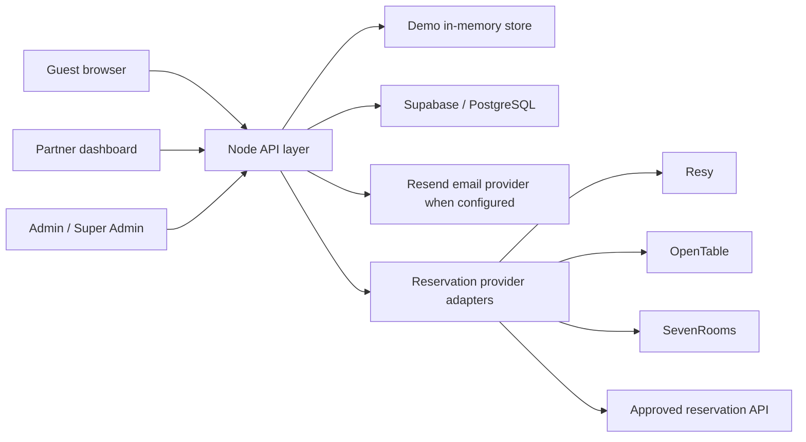
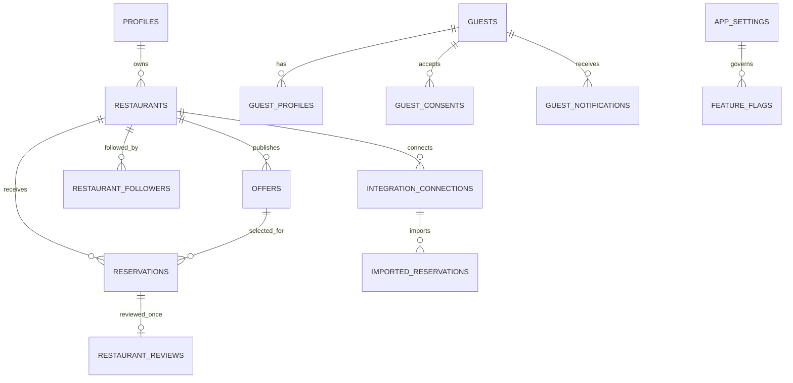
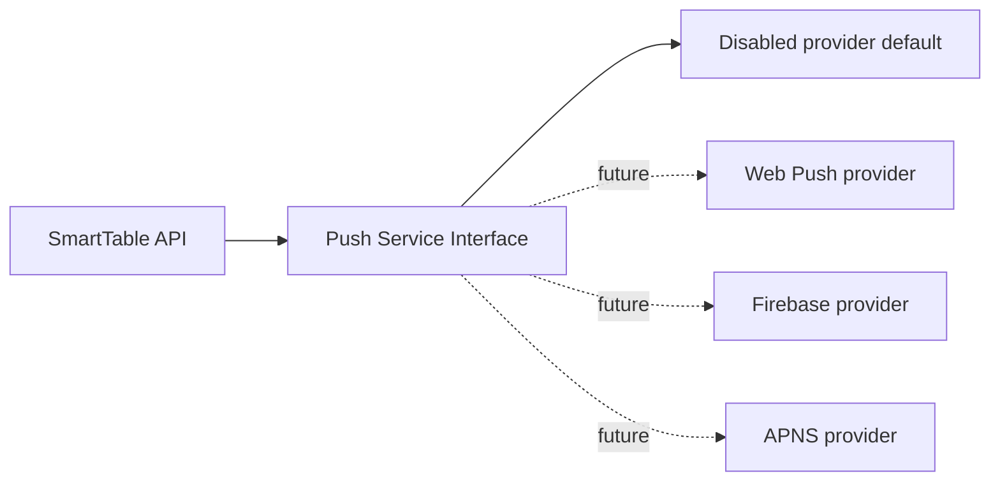

# SmartTable Scale Architecture Readiness

Last updated: 2026-07-18

SmartTable integrates with reservation systems only. It does not connect to restaurant POS systems or access restaurant payment and transaction data.

## Stability Prerequisite

Before this architecture pass, the existing validation suite was re-run:

| Check | Current result |
| --- | --- |
| `npm run build` | Passing |
| `npm test` | Passing before changes |
| `npm run check:platform-mode` | Passing before changes |
| Guest account acceptance checks | Passing |
| Partner API smoke check | Passing |
| Public offers API smoke check | Passing |

The repository previously did not define dedicated `lint` or `typecheck` scripts. This pass adds project-specific equivalents:

| Script | Purpose |
| --- | --- |
| `npm run lint` | Static safety checks for frontend secret exposure, direct DB access, locale keys, and basic app shell quality. |
| `npm run typecheck` | JavaScript syntax/type-shape check using Node's parser. |
| `npm run check:architecture` | Verifies feature flags, booking metadata, push scaffolding, and scale migration coverage. |

## Architecture Overview



The current application is a static browser UI (`public/app.js`) backed by a Node API (`src/app-core.js`). Supabase is supported through REST/RPC calls from the server only. In local/demo mode, the API uses an in-memory data store and `data/app-settings.json` for platform settings persistence.

## Architecture Audit

| Area | Finding | Risk | Safe action in this pass |
| --- | --- | --- | --- |
| Frontend size | `public/app.js` contains routing, state, rendering, validation, dashboards, and account flows. | Harder regression control and repeated renders as features grow. | Do not split yet; document the extraction path and add guard checks. |
| Backend size | `src/app-core.js` contains API routing, auth, demo data, Supabase access, email, integrations, AI demos, and account logic. | Long-term bottleneck for team work and test isolation. | Add small reusable foundations without route rewrites. |
| Feature visibility | Platform mode existed, but individual product features were not centrally evaluated as separate flags. | AI/demo modules can become visible because of mode rather than readiness. | Add `feature_flags` to central app settings and require `flag_key` in the registry. |
| Booking model | Existing reservation flow uses SmartTable status values. | Future reservation providers need source and canonical status metadata. | Add `booking_source` and `booking_status` metadata while preserving existing `status`. |
| Offers | Offers still rely heavily on free text and generic rules. | Hard to filter and enforce offer conditions at scale. | Add structured fields for spend, party limits, drink applicability, blackout periods, and combinability. |
| Reviews | Review flow exists, but production enforcement needs reservation binding. | Fake or duplicate reviews can reduce trust. | Add `reservation_id` and a unique one-review-per-reservation index. |
| Push | Push was mentioned as future functionality but should not appear active. | Users may think push is live without provider configuration. | Add disabled provider interface and DB scaffolding; default flag is off. |
| API consistency | The frontend uses `/api` for SmartTable data. Signed uploads use provider URLs only after API signing. | Good baseline, but response shape is still not fully standardized. | Document next extraction: response envelope, pagination, validation middleware. |
| Components | Multiple string-rendered button/card/table patterns exist. | UI inconsistency and harder accessibility audits. | No broad refactor in this pass; define target component library. |

## Feature Flag System

`platform_mode` remains a high-level mode:

- `basic`
- `ai_concierge`

Individual capabilities are now governed by `feature_flags` inside the central platform settings. The registry still defines mode availability and status, but visibility must also pass the feature flag check.

Default flags:

| Flag | Default | Purpose |
| --- | --- | --- |
| `restaurant_listings` | On | Public restaurant discovery. |
| `discount_offers` | On | Discounted table offers. |
| `reservations` | On | Guest reservation requests/leads. |
| `partner_dashboard` | On | Restaurant partner portal. |
| `admin_management` | On | Admin management tools. |
| `reviews` | On | Verified review foundation. |
| `favorites` | On | Favorite/follow restaurants. |
| `loyalty` | On | Dining photo rewards foundation. |
| `restaurant_analytics` | On | Partner/admin analytics modules that use SmartTable data. |
| `ai_concierge` | On | AI Concierge demo/working feature group when AI mode allows it. |
| `ai_recommendation` | On | AI recommendation/demo feature group when AI mode allows it. |
| `ai_route_planning` | Off | Future route planning. |
| `ai_calendar` | Off | Future calendar interest/integration. |
| `push_notification` | Off | Future push provider integration. |
| `sms` | Off | Future SMS provider integration. |
| `referral_program` | Off | Future referral program. |

Visibility rule:

```text
canShowFeature(featureKey) =
  mode is allowed
  AND feature flag is enabled
  AND status is working
      OR status is demo and AI Demo Visibility is enabled
  AND audience/permission is allowed
```

## Booking Engine Foundation

The current SmartTable reservation request flow remains unchanged for guests and partners. New metadata prepares the model for future reservation-platform imports:

| Field | Values |
| --- | --- |
| `booking_source` | `SMARTTABLE`, `RESY`, `OPENTABLE`, `SEVENROOMS`, `MANUAL` |
| `booking_status` | `pending`, `confirmed`, `declined`, `cancelled`, `expired`, `waiting_external_confirmation`, `completed`, `no_show` |

Existing `status` values remain available for current UI compatibility:

| Existing status | Canonical booking status |
| --- | --- |
| `pending`, `requested` | `pending` |
| `accepted`, `confirmed` | `confirmed` |
| `rejected` | `declined` |
| `cancelled` | `cancelled` |
| `completed` | `completed` |
| `no_show` | `no_show` |

## Offer Conditions

Offers are now prepared for structured conditions:

| Field | Purpose |
| --- | --- |
| `discount_type` | Percent, fixed, or future structured discount type. |
| `minimum_spend` | Minimum spend requirement, if any. |
| `applies_to_drinks` | Whether the offer applies to drinks. |
| `min_party_size` / `max_party_size` | Party-size rules. |
| `time_limit_minutes` | Dining time limit, if any. |
| `blackout_periods` | JSON periods where the offer cannot be used. |
| `combinable` | Whether the offer can be combined with other promotions. |
| `custom_terms` | Structured custom rules for future display/enforcement. |
| `structured_conditions` | JSON summary for filtering and API clients. |

## Data Model Relationships



Core tables to keep stable:

- `restaurants`
- `restaurant_users`
- `profiles`
- `guests`
- `guest_profiles`
- `guest_consents`
- `offers`
- `reservations`
- `restaurant_followers`
- `restaurant_reviews`
- `guest_notifications`
- `admin_notifications`
- `app_settings`
- `feature_flags`
- `integration_connections`
- `imported_reservations`
- `audit_logs`

## Review Rules

Production rule target:

- Only a real guest should review.
- Review eligibility should require a completed reservation.
- One reservation can create one review.
- Partners cannot delete reviews.
- Admins can moderate reviews.

Current safe foundation:

- `restaurant_reviews.reservation_id` is prepared.
- A unique index enforces one review per reservation when reservation binding exists.
- Admin moderation fields are prepared.

## Push Architecture

Push is prepared but inactive by default.



No provider means:

- `push_notification` feature flag remains off.
- `createPushService()` returns a disabled provider.
- Send attempts return `skipped`, not `sent`.

## API Layer Notes

Current:

- Browser calls SmartTable through `/api`.
- Supabase service-role access is isolated to `src/app-core.js`.
- Public config, offers, reservations, guest account, partner, and admin functions are exposed through API handlers.

Recommended next refactor:

1. Extract API router from `src/app-core.js`.
2. Introduce a consistent response envelope:
   - `{ ok, data, error, pagination }`
3. Centralize validation.
4. Centralize auth/role guards.
5. Add pagination to high-volume list endpoints.
6. Add rate limiting middleware for login, signup, reservations, feedback, and AI endpoints.

## Component Library Target

The app currently renders most UI with template strings. A safe future extraction path:

| Component | Current issue | Target |
| --- | --- | --- |
| Button | Multiple `primary-button`, `ghost-button`, inline button patterns. | One button renderer/helper with variants and disabled/loading states. |
| Card | Panels, stat cards, preview cards, feature cards repeat markup. | Shared card shell. |
| Input | Forms have repeated labels/errors. | Shared field helpers with validation summary. |
| Modal | Reservation, follow, review, content editor modals repeat structure. | Shared modal renderer. |
| Badge | Status/demo/feature badges repeat logic. | Shared badge helper. |
| Toast | One global toast exists. | Keep and centralize success/error variants. |
| Tabs | Guest account and partner dashboard use route/hash-like tabs. | Shared tab/nav helper. |
| Empty/Error/Skeleton | Present but inconsistent. | Shared states for loading, empty, error, restricted. |

## SEO Review

Current assets:

- `public/index.html`
- `public/robots.txt`
- `public/sitemap.xml`
- `public/site.webmanifest`
- Runtime meta update in `public/app.js`

Recommended next steps:

- Add canonical URL per route/hash target where deploy framework supports it.
- Add `Restaurant` schema.org for approved public restaurant detail states.
- Add `Offer` schema for active offers where discount data is real.
- Keep AI claims hidden in Basic mode and clearly label demo AI in AI Concierge mode.

## Performance Audit

Observed bottlenecks:

- `public/app.js` is the largest JS payload and should be split after behavior is stable.
- Admin and partner render functions fetch multiple datasets at once; this is okay for MVP but needs pagination for 100+ restaurants.
- Images are URL-based and need consistent sizing/optimization when production storage is connected.

Safe near-term optimizations:

- Lazy-load admin/partner-only panels after login.
- Paginate admin reservations, offers, restaurants, notifications, and logs.
- Cache public content/config briefly with invalidation on admin save.
- Extract heavy AI/demo data into lazy modules, especially when Basic mode is active.

## Security Audit

Current strengths:

- Supabase service-role keys are server-side only.
- Guest login uses generic unsafe-email-safe errors.
- Role checks exist for admin, super admin, partner, and guest paths.
- Guest account endpoints check ownership through authenticated profile/session context.
- Analytics events filter allowed event names and properties.

Risks to address next:

- Add real rate limiting for production deployments, not only demo auth attempts.
- Add CSRF strategy if cookies are introduced.
- Add response envelope and error-code taxonomy.
- Add pagination and maximum body-size checks to imports.
- Continue escaping all rendered user text in the browser.
- Audit all admin/partner mutations for server-side ownership checks after extraction.

## Safest Implementation Order

1. Keep the current tests green and expand check coverage.
2. Extract shared constants/modules:
   - platform settings
   - feature registry
   - booking status/source mapping
   - validation helpers
3. Split API route handlers by domain:
   - auth
   - public marketplace
   - guest account
   - partner
   - admin
   - integrations
4. Add pagination and response envelopes.
5. Extract reusable UI helpers without changing visual behavior.
6. Add real production rate limiting.
7. Add provider-backed reservation sync only through approved reservation-platform APIs.
8. Add real AI Concierge v1 only after database-grounded recommendations and cost logging are ready.

## Developer Notes

- Do not show demo AI numbers as production outcomes.
- Do not add POS integrations.
- Do not expose individual guest preference profiles to restaurants.
- Keep Basic mode complete and usable without AI.
- Use feature flags for capabilities; use platform mode only as the high-level product state.
